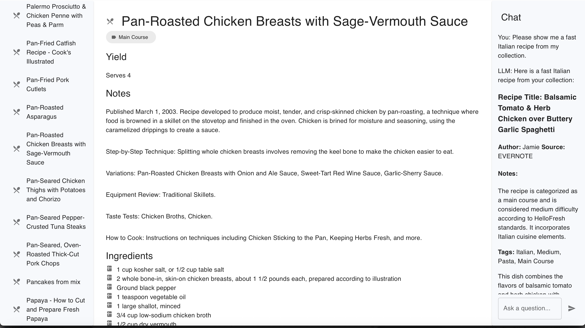

This is a toy Recipe Manager project that I've been working on just for fun.  The result isn't particularly useful yet, but I but I wanted to write something something which would let me to pull in:

* Both front end (Kotlin/React) and back end (Kotlin/Ktor)
* Data (MongoDB)
* The use of LLMs & semantic search (using ChatGPT)

I did not originally intend for this to be shown off, but it kind of shows some of the breadth of technologies that I've
dealt with.

* The backend is in `/server`
* The front end is in `/web`
* `/shared` contains code (mostly data definitions) used by both

(I originally tried to use Jetpack Compose for the front end, but found that it really didn't do everything I wanted in my web UI, so I fell back to vanilla React. You can see the remnants of my original attempt in `/composeApp`.)

I usually like to design with an "end-to-end" approach--as such, this is a complete application from UI to data storage.  But it doesn't have a whole lot of interesting _features_ yet. 

